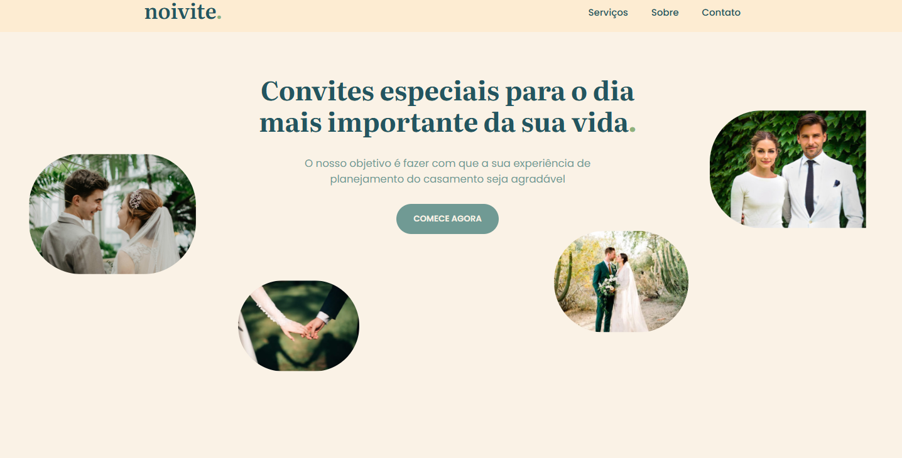

# Noivite.

> Prototipação da landing page

[Click aqui para acessar a prototipação](https://www.figma.com/design/RkhK6jYITEwuxYaVUfO0ju/Landing-page-%2BpraTi?node-id=0-1&t=bHPRoMhBWKh9w9vd-1)

> Aprimorar o projeto da atividade 03 com todo o conhecimento adquirido (e prévio, se houver). Faça o seu melhor.

[Click aqui para acessar landing page](https://samilisbrito.github.io/Noivite/)

## NOVAS FEATURES (NO MÍNIMO ESSAS):

- Crie uma branche adicional para o desenvolvimento dos novos recursos do projeto;
- Reestruture a aplicação para que ela seja estruturada através de Grid e Flexbox;
- Faça com que as transições sejam assíncronas através de: ajax, fetch e promises;
- Adicione operações CRUD com o LocalStorage;
- Responsividade completa.

## OPCIONAIS DIFERENCIAIS:
- Uso de libs como Bootstrap, Tailwind, Angular e afins;
- Tratativa de erros;
- Dark mode;
- Animações (Carousel, por exemplo);
